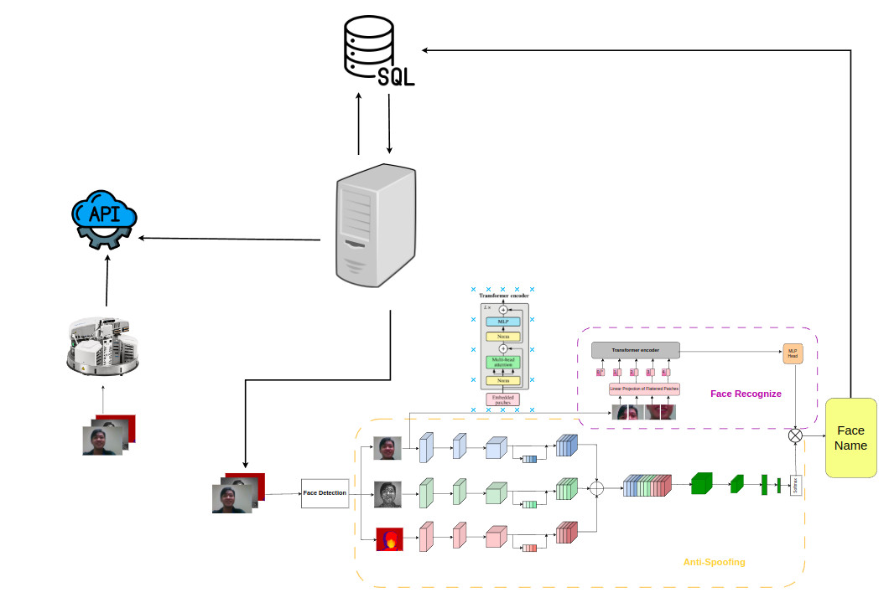

# TensorBot-Vision


## Pipeline



- `172.17.0.1 ` Là địa chỉ local chỉ có máy tính mình mới truy cập được
- `192.168.71.11` Là địa chỉ global máy tính khác kết nối cùng mạng có thề truy cập được
- Tắt tường lửa
```
sudo ufw disable
```
